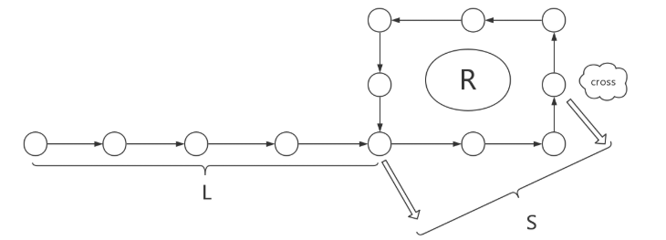
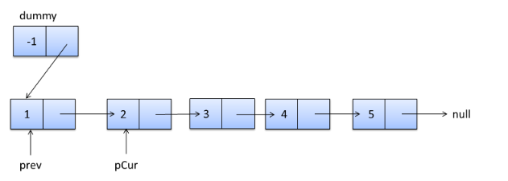
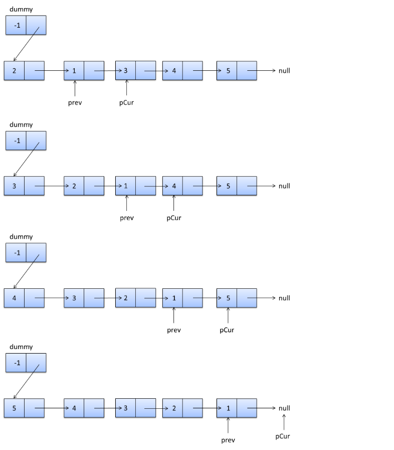
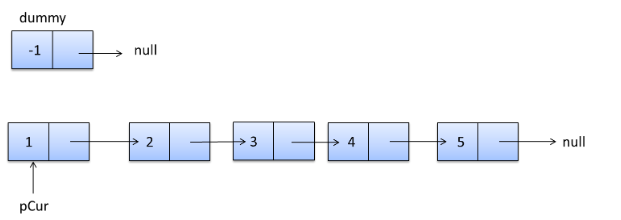
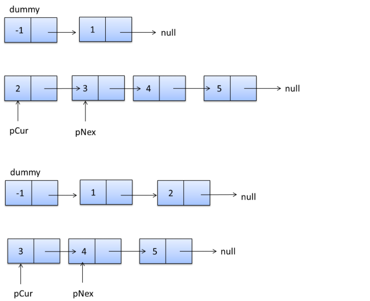

# Algorithm
## Link List
### 1、如何确定单向链表有环，找出环入口并计算环的长度
#### 暴力遍历法
首先从头节点开始，依次遍历单链表的每一个节点。每遍历到一个新节点，就从头节点重新遍历新节点之前的所有节点，用新节点ID和此节点之前所有节点ID依次作比较。如果发现新节点之前的所有节点当中存在相同节点ID，则说明该节点被遍历过两次，链表有环；如果之前的所有节点当中不存在相同的节点，就继续遍历下一个新节点，继续重复刚才的操作。    
例如这样的链表：A->B->C->D->B->C->D， 当遍历到节点D的时候，我们需要比较的是之前的节点A、B、C，不存在相同节点。这时候要遍历的下一个新节点是B，B之前的节点A、B、C、D中恰好也存在B，因此B出现了两次，判断出链表有环。  
假设从链表头节点到入环点的距离是D，链表的环长是S。那么算法的时间复杂度是0+1+2+3+....+(D+S-1) = (D+S-1)\*(D+S)/2 ， 可以简单地理解成 O(N\*N)。而此算法没有创建额外存储空间，空间复杂度可以简单地理解成为O(1)。
#### 遍历法改进
首先创建一个以节点ID为键的HashSet集合，用来存储曾经遍历过的节点。然后同样是从头节点开始，依次遍历单链表的每一个节点。每遍历到一个新节点，就用新节点和HashSet集合当中存储的节点作比较，如果发现HashSet当中存在相同节点ID，则说明链表有环，如果HashSet当中不存在相同的节点ID，就把这个新节点ID存入HashSet，之后进入下一节点，继续重复刚才的操作。  
这个方法在流程上和暴力遍历法类似，本质的区别是使用了HashSet作为额外的缓存。
假设从链表头节点到入环点的距离是D，链表的环长是S。而每一次HashSet查找元素的时间复杂度是O(1), 所以总体的时间复杂度是1\*(D+S)=D+S，可以简单理解为O(N)。而算法的空间复杂度还是D+S-1，可以简单地理解成O(N)。  
#### 双指针法
首先创建两个指针1和2，同时指向这个链表的头节点。然后开始一个大循环，在循环体中，让指针1每次向下移动一个节点，让指针2每次向下移动两个节点，然后比较两个指针指向的节点是否相同。如果相同，则判断出链表有环，如果不同，则继续下一次循环。   
例如链表A->B->C->D->B->C->D，两个指针最初都指向节点A，进入第一轮循环，指针1移动到了节点B，指针2移动到了C。第二轮循环，指针1移动到了节点C，指针2移动到了节点B。第三轮循环，指针1移动到了节点D，指针2移动到了节点D，此时两指针指向同一节点，判断出链表有环。  
假设从链表头节点到入环点的距离是D，链表的环长是S。那么循环会进行S次，可以简单理解为O（N）。除了两个指针以外，没有使用任何额外存储空间，所以空间复杂度是O（1）。  
代码如下：  
```c++
bool hasCycle(ListNode *head) {
    auto walker = head;
    auto runner = head;
    while(runner && runner->next)
    {
        walker = walker->next;
        runner = runner->next->next;
        if(walker == runner)
            return true;
    }
    return false;
    }
```
#### 环长度及入口确定
   
以图片为例，假设环入口距离链表头的长度为L，快慢指针相遇的位置为cross，且该位置距离环入口的长度为S。考虑快慢指针移动的距离，慢指针走了L+S，快指针走了L+S+nR(这是假设相遇之前快指针已经绕环n圈)。由于快指针的速度是慢指针的两倍，相同时间下快指针走过的路程就是慢指针的两倍，所以有2(L+S)=L+S+nR，化简得L+S=nRL+S=nR
当n=1时，即快指针在相遇之前多走了一圈，即L+S=R，也就是L=R−S，观察图片，L表示从链表头到环入口的距离，而R−S表示从cross继续移动到环入口的距离，既然二者是相等的，那么如果采用两个指针，一个从表头出发，一个从cross出发，那么它们将同时到达环入口。即二者相等时便是环入口节点  
当n>1时，上式为L=nR−S，L仍然表示从链表头到达环入口的距离，而nR−S可以看成从cross出发移动nR步后再倒退S步，从cross移动nR步后回到cross位置，倒退S步后是环入口，所以也是同时到达环入口。即二者相等时便是环入口节点。
所以寻找环入口的方法就是采用两个指针，一个从表头出发，一个从相遇点出发，一次都只移动一步，当二者相等时便是环入口的位置
求环入口代码如下：
```C++
ListNode *detectCycle(ListNode *head) {
    auto walker = head;
    auto runner = head;
    while(runner && runner->next)
    {
        walker = walker->next;
        runner = runner->next->next;
        if(walker == runner)
            break;
    }
    if(!runner || !runner->next)
        return nullptr;
    auto headWalker = head;
    auto crossWalker = walker;
    while(headWalker != crossWalker)
    {
        headWalker = headWalker->next;
        crossWalker = crossWalker->next;
    }
    return headWalker;
    }
```  
求环的长度：
第一种方法是利用上面求出的环入口，再走一圈就可以求出长度，代码如下：
```C++
int cycleLen(ListNode* head)
{
    auto cycleIn = detectCycle(head);
    int len = 1;
    auto walker = cycleIn;
    while(walker->next != cycleIn)
    {
        ++len;
        walker = walker->next;
    }
    return len;
}
```
第二种方法是当快慢指针相遇时，继续移动直到第二次相遇，此时快指针移动的距离正好比慢指针多一圈，代码如下:
```C++
int cycleLen(ListNode* head)
{
    auto walker = head;
    auto runner = head;
    while(runner && runner->next)
    {
        walker = walker->next;
        runner = runner->next;
        if(walker == runner)
            break;
    }
    int len = 0;
    while(runner && runner->next)
    {
        ++len;
        walker = walker->next;
        runner = runner->next;
        if(walker == runner)
            break;
    }
    return len;
}
```
### 反转单链表
链表结点定义
```C++
class ListNode{
    int val;
    ListNode *next;
    ListNode(int x){
        this->val = x;
        this->next = NULL;
    }
}
```
#### 就地反转法
把当前链表的下一个节点pCur插入到头结点dummy的下一个节点中，就地反转。
dummy->1->2->3->4->5的就地反转过程：  
dummy->2->1->3->4->5  
dummy->3->2->1->4->5  
dummy->4>-3->2->1->5  
dummy->5->4->3->2->1  
初始状态：  

过程：  
pCur是需要反转的节点。  
1、prev连接下一次需要反转的节点  
2、反转节点pCur  
3、纠正头结点dummy的指向  
4、pCur指向下一次要反转的节点  
图示如下：  

代码如下：  
```C++
ListNode *reverseList(ListNode *head){
    if(head == NULL){
        return head;
    }
    ListNode dummy = new ListNode(-1);
    dummy.next = head;
    ListNode *prev = dummy.next;
    ListNode * pCur = prev.next;
    while(pCur != NULL){
        prev.next = pCur.next;
        pCur.next = dummy.next;
        dummy.next = pCur;
        pCur = prev.next;
    }
    return dummy.next;
}
```   
#### 头结点插入法
新建一个头结点，遍历原链表，把每个节点用头结点插入到新建链表中。最后，新建的链表就是反转后的链表。  
初始状态如图：  
  
过程：  
pCur是要插入到新链表的节点。  
pNex是临时保存的pCur的next。  
1、pNex保存下一次要插入的节点  
2、把pCur插入到dummy中  
3、纠正头结点dummy的指向  
4、pCur指向下一次要插入的节点  
图示如下：  
  
代码如下：  
```C++
ListNode *reverseList(ListNode *head) {
    ListNode dummy = new ListNode(-1);
    ListNode pCur = head;
    while(pCur != NULL){
        ListNode *pNext = pCur.next;
        pCur.next = dummy.next;
        dummy.next = pCur;
        pCur = pNext;
    }
    return dummy.next;
}
```
## 树
