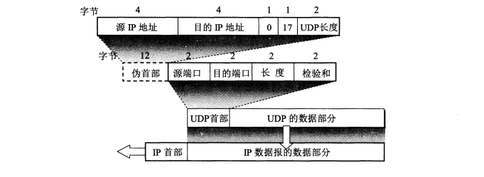
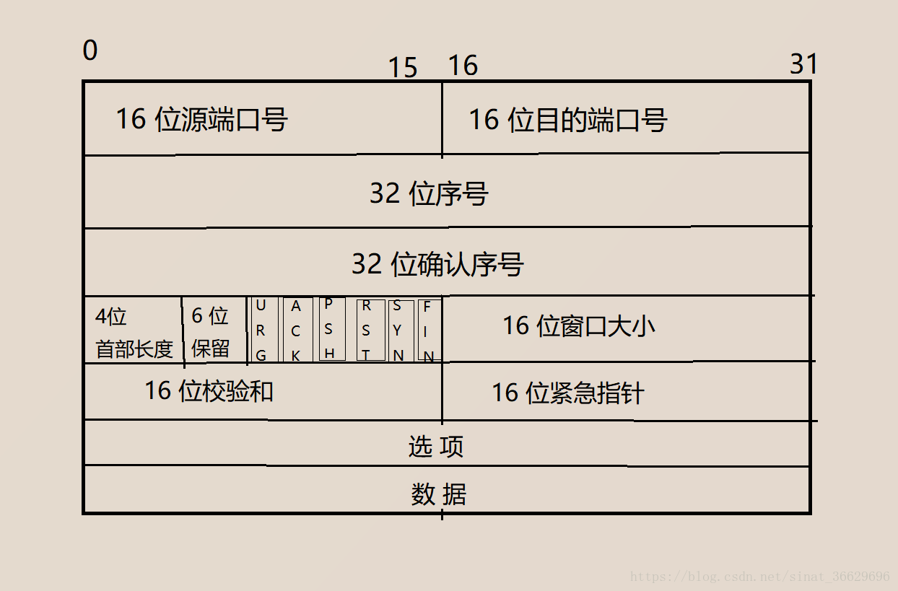
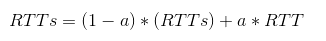
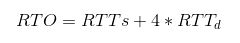
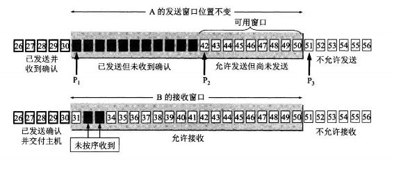
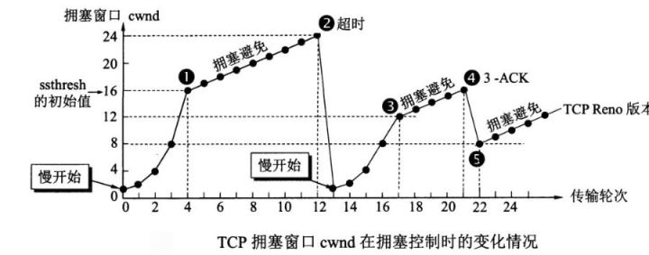
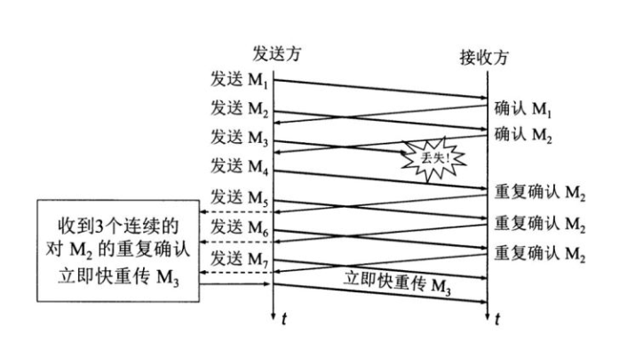

# 网络
## TCP和UDP
### TCP与UDP的特点与区别
TCP(Transmission Control Protocol)
是面向连接的，提供可靠交付，有流量控制，拥塞控制，提供全双工通信，面向字节流（把应用层传下来的报文看成字节流，把字节流组织成大小不等的数据块），每一条 TCP 连接只能是点对点的（一对一）。  
UDP(User Datagram Protocol)
用户数据报协议为应用程序提供了一种无需建立连接就可以发送封装的 IP 数据报的方法。UDP是一种保留消息边界的简单的面向数据报的协议。UDP不提供差错纠正、队列管理、重复消除、流量控制和拥塞控制，但提供差错检测（包含我们在传输层中碰到的第一个真实的端到端（end-to-end）校验和）。这种协议自身提供最小功能，因此使用它的应用程序要做许多关于数据报如何发送和处理的控制工作。想要保证数据被可靠传递或正确排序，应用程序必须自己实现这些保护功能。一般来说，每个被应用程序请求的UDP输出操作只产生一个UDP数据报，从而发送一个IP数据报。而对于面向数据流的传输层协议（例如TCP），应用程序写入的全部数据与真正在单个IP数据报里传送的或接收方接收的内容可能没有联系。  
UDP主要特点：  
1、UDP是无连接的，即发送数据之前不需要建立连接，因此减少了开销和发送数据之前的时延。
2、UDP使用尽最大努力交付，即不保证可靠交付，因此主机不需要维持复杂的连接状态表。
3、UDP是面向报文的。发送方的UDP对应用程序交下来的报文，在添加首部后就向下交付IP层。UDP对应用层交下来的报文，既不合并，也不拆分，而是保留这些报文的边界。因此，应用程序必须选择合适大小的报文。
4、UDP没有拥塞控制，因此网络出现的拥塞不会使源主机的发送速率降低。很多的实时应用（如IP电话、实时视频会议等）要去源主机以恒定的速率发送数据，并且允许在网络发生拥塞时丢失一些数据，但却不允许数据有太多的时延。UDP正好符合这种要求。
5、UDP支持一对一、一对多、多对一和多对多的交互通信。
6、UDP的首部开销小，只有8个字节，比TCP的20个字节的首部要短。  
虽然某些实时应用需要使用没有拥塞控制的UDP,但当很多的源主机同时都向网络发送高速率的实时视频流时,网络就有可能发生拥塞,结果大家都无法正常接收。因此,不使用拥塞控制功能的UDP有可能会引起网络产生严重的拥塞问题。
还有一些使用UDP的实时应用,需要对UDP的不可靠的传输进行适当的改进,以减少数据的丢失。在这种情况下,应用进程本身可以在不影响应用的实时性的前提下,增加些提高可靠性的措施,如采用前向纠错或重传已丢失的报文。  
### TCP、UDP首部格式
  
UDP首部字段只有8个字节，包括源端口、目的端口、长度、检验和。12字节的伪首部是为了计算检验和临时添加的。  
源端口：源端口号。在需要对方回信时选用。不需要时可用全0。  
目的端口：目的端口号。这在终点交付报文时必须要使用到。  
长度：UDP用户数据报的长度，其最小值是8（仅有首部），发送一个带0字节数据的UDP数据报是允许的。值得注意的是，UDP长度字段是冗余的；IPV4头部包含了数据报的总长度，同时IPV6头部包含了负载长度。因此，一个UDP/IPV4数据报的长度等于IPV4数据报的总长度减去IPV4头部的长度。一个UDP/IPV6数据报的长度等于包含在IPV6头部中的负载长度（payload length）字段的值减去所有扩展头部（除非使用了超长数据报）的长度。这两种情况下，UDP长度字段应该与从IP层提供的信息计算得到的长度是一致的。  
校验和：检测UDP用户数据报在传输中是否有错。有错就丢弃。   
  
TCP首部字段有20个字节。  
序号：用于对字节流进行编号，例如序号为301，表示第一个字节的编号为301，如果携带的数据长度为100字节，那么下一个报文段的序号应为401。  
确认号：期望收到的下一个报文段的序号。例如B正确收到A发送来的一个报文段，序号为501，携带的数据长度为200字节，因此B期望下一个报文段的序号为701，B发送给A的确认报文段中确认号就为701。  
数据偏移：指的是数据部分距离报文段起始处的偏移量，实际上指的是首部的长度。  
控制位：八位从左到右分别是 CWR，ECE，URG，ACK，PSH，RST，SYN，FIN。  
CWR：CWR标志与后面的ECE标志都用于IP首部的ECN字段，ECE标志为1时，则通知对方已将拥塞窗口缩小；  
ECE：若其值为1则会通知对方，从对方到这边的网络有阻塞。在收到数据包的IP首部中ECN为1时将TCP首部中的ECE设为1；  
URG：该位设为1，表示包中有需要紧急处理的数据，对于需要紧急处理的数据，与后面的紧急指针有关；  
ACK：该位设为1，确认应答的字段有效，TCP规定除了最初建立连接时的SYN包之外该位必须设为1；  
PSH：该位设为1，表示需要将收到的数据立刻传给上层应用协议，若设为0，则先将数据进行缓存；  
RST：该位设为1，表示TCP连接出现异常必须强制断开连接；  
SYN：用于建立连接，该位设为1，表示希望建立连接，并在其序列号的字段进行序列号初值设定；  
FIN：该位设为1，表示今后不再有数据发送，希望断开连接。当通信结束希望断开连接时，通信双方的主机之间就可以相互交换FIN位置为1的TCP段。  
每个主机又对对方的 FIN 包进行确认应答之后可以断开连接。不过，主机收到 FIN 设置为1的TCP段之后不必马上回复一个FIN包，而是可以等到缓冲区中的所有数据都因为已成功发送而被自动删除之后再发FIN包；  
窗口：窗口值作为接收方让发送方设置其发送窗口的依据。之所以要有这个限制，是因为接收方的数据缓存空间是有限的。  
### TCP 的三次握手和四次挥手
TCP是一种面向连接的单播协议，在发送数据前，通信双方必须在彼此间建立一条连接。所谓的“连接”，其实是客户端和服务器的内存里保存的一份关于对方的信息，如IP地址、端口号等。  
TCP可以看成是一种字节流，它会处理 IP 层或以下的层的丢包、重复以及错误问题。在连接的建立过程中，双方需要交换一些连接的参数。这些参数可以放在TCP头部。  
TCP提供了一种可靠、面向连接、字节流、传输层的服务，采用三次握手建立一个连接；采用四次挥手来关闭一个连接。  
一个TCP连接由一个4元组构成，分别是两个IP地址和两个端口号。一个TCP连接通常分为三个阶段：启动、数据传输、退出（关闭）。  
当TCP接收到另一端的数据时，它会发送一个确认，但这个确认不会立即发送，一般会延迟一会（提供网络利用率这部分有讲到）。  
ACK是累积的，一个确认字节号N的ACK表示所有直到N的字节（不包括N）已经成功被接收了。这样的好处是如果一个ACK丢失，很可能后续的ACK就足以确认前面的报文段了。  
一个完整的TCP连接是双向和对称的，数据可以在两个方向上平等地流动。给上层应用程序提供一种双工服务。一旦建立了一个连接，这个连接的一个方向上的每个TCP报文段都包含了相反方向上的报文段的一个ACK。  
序列号的作用是使得一个TCP接收端可丢弃重复的报文段，记录以杂乱次序到达的报文段。因为TCP 使用IP来传输报文段，而IP不提供重复消除或者保证次序正确的功能。  
另一方面，TCP是一个字节流协议，绝不会以杂乱的次序给上层程序发送数据。因此TCP接收端会被迫先保持大序列号的数据不交给应用程序，直到缺失的小序列号的报文段被填满。 
#### 三次握手
  
假设A为客户端，B为服务器端。
首先B处于LISTEN(监听)状态，等待客户的连接请求。  
A向B发送连接请求报文，SYN=1，ACK=0，选择一个初始的序号 x。  
B收到连接请求报文，如果同意建立连接，则向A发送连接确认报文，SYN=1，ACK=1，确认号为x+1，同时也选择一个初始的序号y。  
A收到B的连接确认报文后，还要向B发出确认，确认号为y+1，序号为x+1。
B收到A的确认后，连接建立。  
##### 为什么是三次握手
1、第三次握手是为了防止失效的连接请求到达服务器，让服务器错误打开连接。  
2、换个易于理解的视角来看为什么要3次握手。  
客户端和服务端通信前要进行连接，“3次握手”的作用就是双方都能明确自己和对方的收、发能力是正常的。  
第一次握手：客户端发送网络包，服务端收到了。这样服务端就能得出结论：客户端的发送能力、服务端的接收能力是正常的。  
第二次握手：服务端发包，客户端收到了。这样客户端就能得出结论：服务端的接收、发送能力，客户端的接收、发送能力是正常的。从客户端的视角来看，我接到了服务端发送过来的响应数据包，说明服务端接收到了我在第一次握手时发送的网络包，并且成功发送了响应数据包，这就说明，服务端的接收、发送能力正常。而另一方面，我收到了服务端的响应数据包，说明我第一次发送的网络包成功到达服务端，这样，我自己的发送和接收能力也是正常的。  
第三次握手：客户端发包，服务端收到了。这样服务端就能得出结论：客户端的接收、发送能力，服务端的发送、接收能力是正常的。第一、二次握手后，服务端并不知道客户端的接收能力以及自己的发送能力是否正常。  
而在第三次握手时，服务端收到了客户端对第二次握手作的回应。从服务端的角度，我在第二次握手时的响应数据发送出去了，客户端接收到了。所以，我的发送能力是正常的。而客户端的接收能力也是正常的。  
经历了上面的三次握手过程，客户端和服务端都确认了自己的接收、发送能力是正常的。之后就可以正常通信了。  
每次都是接收到数据包的一方可以得到一些结论，发送的一方其实没有任何头绪。我虽然有发包的动作，但是我怎么知道我有没有发出去，而对方有没有接收到呢？  
而从上面的过程可以看到，最少是需要三次握手过程的。两次达不到让双方都得出自己、对方的接收、发送能力都正常的结论。  
其实每次收到网络包的一方至少是可以得到：对方的发送、我方的接收是正常的。而每一步都是有关联的，下一次的“响应”是由于第一次的“请求”触发，因此每次握手其实是可以得到额外的结论的。  
比如第三次握手时，服务端收到数据包，表明看服务端只能得到客户端的发送能力、服务端的接收能力是正常的，但是结合第二次，说明服务端在第二次发送的响应包，客户端接收到了，并且作出了响应，从而得到额外的结论：客户端的接收、服务端的发送是正常的。  
#### 四次挥手
  
客户端发送一个FIN段，并包含一个希望接收者看到的自己当前的序列号K. 同时还包含一个ACK表示确认对方最近一次发过来的数据。  
服务端将K值加1作为ACK序号值，表明收到了上一个包。这时上层的应用程序会被告知另一端发起了关闭操作，通常这将引起应用程序发起自己的关闭操作。  
服务端发起自己的FIN段，ACK=K+1, Seq=L。  
客户端确认。进入TIME-WAIT状态，等待2MSL（最大报文存活时间）后释放连接。ACK=L+1。  
##### 为什么建立连接是三次握手，而关闭连接却是四次挥手呢？
1、TCP连接是双向传输的对等的模式，就是说双方都可以同时向对方发送或接收数据。当有一方要关闭连接时，会发送指令告知对方，我要关闭连接了。  
2、这时对方会回一个ACK，此时一个方向的连接关闭。但是另一个方向仍然可以继续传输数据，也就是说，服务端收到客户端的FIN标志，知道客户端想要断开这次连接了，但是，我服务端，我还想发数据呢？我等到发送完了所有的数据后，会发送一个FIN段来关闭此方向上的连接。接收方发送ACK确认关闭连接。  
注意，接收到FIN报文的一方只能回复一个ACK, 它是无法马上返回对方一个FIN报文段的，因为结束数据传输的“指令”是上层应用层给出的，我只是一个“搬运工”，我无法了解“上层的意志”。  
3、客户端发送了FIN连接释放报文之后，服务器收到了这个报文，就进入了 CLOSE-WAIT状态。这个状态是为了让服务器端发送还未传送完毕的数据，传送完毕之后，服务器会发送FIN连接释放报文。  
4、因为服务端在LISTEN状态下，收到建立连接请求的SYN报文后，把ACK和 SYN放在一个报文里发送给客户端。而关闭连接时，当收到对方的FIN报文时，仅仅表示对方不再发送数据了但是还能接收数据，己方是否现在关闭发送数据通道，需要上层应用来决定，因此，己方ACK和FIN一般都会分开发。  
##### TIME_WAIT
客户端接收到服务器端的 FIN 报文后进入此状态，此时并不是直接进入CLOSED状态，还需要等待一个时间计时器设置的时间2MSL。这么做有两个理由:    
确保最后一个确认报文能够到达。如果B没收到A发送来的确认报文，那么就会重新发送连接释放请求报文，A等待一段时间就是为了处理这种情况的发生。  
等待一段时间是为了让本连接持续时间内所产生的所有报文都从网络中消失，使得下一个新的连接不会出现旧的连接请求报文。  
### TCP短连接和长连接的区别
短连接：Client 向Server发送消息，Server回应Client，然后一次读写就完成了，这时候双方任何一个都可以发起close操作，不过一般都是Client先发起close操作。短连接一般只会在Client/Server间传递一次读写操作。  
短连接的优点：管理起来比较简单，建立存在的连接都是有用的连接，不需要额外的控制手段。  
长连接：Client与Server完成一次读写之后，它们之间的连接并不会主动关闭，后续的读写操作会继续使用这个连接。  
在长连接的应用场景下，Client端一般不会主动关闭它们之间的连接，Client与Server之间的连接如果一直不关闭的话，随着客户端连接越来越多，Server 压力也越来越大，这时候Server端需要采取一些策略，如关闭一些长时间没有读写事件发生的连接，这样可以避免一些恶意连接导致Serve 端服务受损；如果条件再允许可以以客户端为颗粒度，限制每个客户端的最大长连接数，从而避免某个客户端连累后端的服务。  
长连接和短连接的产生在于Client和 Server采取的关闭策略，具体的应用场景采用具体的策略。  
### TCP粘包、拆包及解决办法
#### 为什么常说TCP有粘包和拆包的问题而不说UDP？
UDP是基于报文发送的，UDP首部采用了 16bit来指示UDP数据报文的长度，因此在应用层能很好的将不同的数据报文区分开，从而避免粘包和拆包的问题。  
而TCP是基于字节流的，虽然应用层和TCP传输层之间的数据交互是大小不等的数据块，但是TCP并没有把这些数据块区分边界，仅仅是一连串没有结构的字节流；另外从TCP的帧结构也可以看出，在TCP的首部没有表示数据长度的字段，基于上面两点，在使用TCP传输数据时，才有粘包或者拆包现象发生的可能。  
#### 什么是粘包、拆包？
假设Client向Server连续发送了两个数据包，用packet1和packet2来表示，那么服务端收到的数据可以分为三种情况，现列举如下：  
第一种情况，接收端正常收到两个数据包，即没有发生拆包和粘包的现象。  
  
第二种情况，接收端只收到一个数据包，但是这一个数据包中包含了发送端发送的两个数据包的信息，这种现象即为粘包。这种情况由于接收端不知道这两个数据包的界限，所以对于接收端来说很难处理。  
  
第三种情况，这种情况有两种表现形式，如下图。接收端收到了两个数据包，但是这两个数据包要么是不完整的，要么就是多出来一块，这种情况即发生了拆包和粘包。这两种情况如果不加特殊处理，对于接收端同样是不好处理的。  
  
#### 为什么会发生 TCP 粘包、拆包？
1、要发送的数据大于TCP发送缓冲区剩余空间大小，将会发生拆包。  
2、待发送数据大于MSS（最大报文长度）,TCP在传输前将进行拆包。  
3、要发送的数据小于TCP发送缓冲区的大小，TCP将多次写入缓冲区的数据一次发送出去，将会发生粘包。  
4、接收数据端的应用层没有及时读取接收缓冲区中的数据，将发生粘包。  
#### 粘包、拆包解决办法
由于TCP本身是面向字节流的，无法理解上层的业务数据，所以在底层是无法保证数据包不被拆分和重组的，这个问题只能通过上层的应用协议栈设计来解决，根据业界的主流协议的解决方案，归纳如下：  
1、消息定长：发送端将每个数据包封装为固定长度（不够的可以通过补0填充），这样接收端每次接收缓冲区中读取固定长度的数据就自然而然的把每个数据包拆分开来。  
2、设置消息边界：服务端从网络流中按消息边界分离出消息内容。在包尾增加回车换行符进行分割，例如FTP协议。
3、将消息分为消息头和消息体：消息头中包含表示消息总长度（或者消息体长度）的字段。
4、更复杂的应用层协议比如Netty中实现的一些协议都对粘包、拆包做了很好的处理。
### TCP可靠传输
TCP使用超时重传来实现可靠传输：如果一个已经发送的报文段在超时时间内没有收到确认，那么就重传这个报文段。  
一个报文段从发送再到接收到确认所经过的时间称为往返时间RTT，加权平均往返时间RTTs计算如下：   
  
其中，0 ≤ a ＜ 1，RTTs随着a的增加更容易受到RTT的影响。超时时间RTO应该略大于RTTs，TCP使用的超时时间计算如下：  
  
其中RTTd为偏差的加权平均值。
### TCP滑动窗口
窗口是缓存的一部分，用来暂时存放字节流。发送方和接收方各有一个窗口，接收方通过TCP报文段中的窗口字段告诉发送方自己的窗口大小，发送方根据这个值和其它信息设置自己的窗口大小。  
发送窗口内的字节都允许被发送，接收窗口内的字节都允许被接收。如果发送窗口左部的字节已经发送并且收到了确认，那么就将发送窗口向右滑动一定距离，直到左部第一个字节不是已发送并且已确认的状态；接收窗口的滑动类似，接收窗口左部字节已经发送确认并交付主机，就向右滑动接收窗口。  
接收窗口只会对窗口内最后一个按序到达的字节进行确认，例如接收窗口已经收到的字节为{31, 34, 35}，其中{31}按序到达，而{34, 35}就不是，因此只对字节31进行确认。发送方得到一个字节的确认之后，就知道这个字节之前的所有字节都已经被接收。  
  
### TCP流量控制
流量控制是为了控制发送方发送速率，保证接收方来得及接收。  
接收方发送的确认报文中的窗口字段可以用来控制发送方窗口大小，从而影响发送方的发送速率。将窗口字段设置为 0，则发送方不能发送数据。  
实际上，为了避免此问题的产生，发送端主机会时不时的发送一个叫做窗口探测的数据段，此数据段仅包含一个字节来获取最新的窗口大小信息。  
### TCP拥塞控制
如果网络出现拥塞，分组将会丢失，此时发送方会继续重传，从而导致网络拥塞程度更高。因此当出现拥塞时，应当控制发送方的速率。这一点和流量控制很像，但是出发点不同。流量控制是为了让接收方能来得及接收，而拥塞控制是为了降低整个网络的拥塞程度。  
  
TCP主要通过四个算法来进行拥塞控制：  
慢开始、拥塞避免、快重传、快恢复。  
发送方需要维护一个叫做拥塞窗口（cwnd）的状态变量，注意拥塞窗口与发送方窗口的区别：拥塞窗口只是一个状态变量，实际决定发送方能发送多少数据的是发送方窗口。  
为了便于讨论，做如下假设：  
1、接收方有足够大的接收缓存，因此不会发生流量控制；  
2、虽然 TCP 的窗口基于字节，但是这里设窗口的大小单位为报文段。  
  
慢开始与拥塞避免  
发送的最初执行慢开始，令cwnd = 1，发送方只能发送1个报文段；当收到确认后，将cwnd加倍，因此之后发送方能够发送的报文段数量为：2、4、8 ...  
注意到慢开始每个轮次都将cwnd加倍，这样会让cwnd增长速度非常快，从而使得发送方发送的速度增长速度过快，网络拥塞的可能性也就更高。设置一个慢开始门限ssthresh，当cwnd >= ssthresh时，进入拥塞避免，每个轮次只将cwnd加1。  
如果出现了超时，则令ssthresh = cwnd / 2，然后重新执行慢开始。  
快重传与快恢复  
在接收方，要求每次接收到报文段都应该对最后一个已收到的有序报文段进行确认。例如已经接收到M1和M2，此时收到M4，应当发送对M2的确认。  
在发送方，如果收到三个重复确认，那么可以知道下一个报文段丢失，此时执行快重传，立即重传下一个报文段。例如收到三个M2，则M3丢失，立即重传M3。  
在这种情况下，只是丢失个别报文段，而不是网络拥塞。因此执行快恢复，令 ssthresh = cwnd / 2 ，cwnd = ssthresh，注意到此时直接进入拥塞避免。  
慢开始和快恢复的快慢指的是cwnd的设定值，而不是cwnd的增长速率。慢开始cwnd设定为 1，而快恢复cwnd设定为ssthresh。  
  
### 提高网络利用率
1、Nagle 算法  
发送端即使还有应该发送的数据，但如果这部分数据很少的话，则进行延迟发送的一种处理机制。具体来说，就是仅在下列任意一种条件下才能发送数据。如果两个条件都不满足，那么暂时等待一段时间以后再进行数据发送。  
已发送的数据都已经收到确认应答。
可以发送最大段长度的数据时。  
2、延迟确认应答  
接收方收到数据之后可以并不立即返回确认应答，而是延迟一段时间的机制。  
在没有收到 2*最大段长度的数据为止不做确认应答。  
其他情况下，最大延迟 0.5秒 发送确认应答。  
TCP文件传输中，大多数是每两个数据段返回一次确认应答。  
3、捎带应答  
在一个TCP包中既发送数据又发送确认应答的一种机制，由此，网络利用率会提高，计算机的负荷也会减轻，但是这种应答必须等到应用处理完数据并将作为回执的数据返回为止。  

